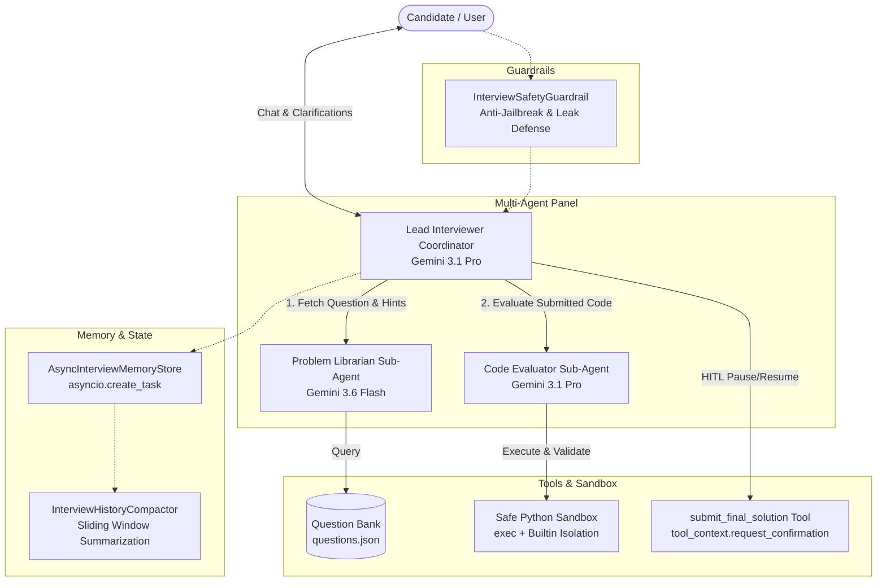

# 🤖 Tech Interviewer GenAI Agent

An interactive, multi-agent AI Technical Interviewer built with the **Google Agent Development Kit (ADK)** and powered by **Gemini 3.1 Pro** and **Gemini 3.6 Flash**.

This project simulates realistic, end-to-end technical coding interviews by combining conversational reasoning, dynamic question management, progressive hinting, safe sandboxed code execution, asynchronous background memory management, security guardrails, and native Human-in-the-Loop (HITL) final submission confirmations.

---

## 🎯 Problem & Solution

* **The Problem:** Practicing for software engineering technical interviews alone is challenging. Traditional static platforms lack conversational dialogue, cannot answer clarifying questions about constraints in real-time, and either spoil solutions immediately or provide no guided hints.
* **The Solution:** A specialized **Multi-Agent Interview Panel** that acts as an empathetic yet rigorous technical interviewer. The system walks candidates through problem selection, clarifies constraints, provides progressive hints without leaking answers, executes code against hidden test cases in an isolated sandbox, and delivers comprehensive performance rubrics.

---

## 🏛️ System Architecture

The system uses a hierarchical **Coordinator Multi-Agent Pattern** with strategic model tiering, explicit tool boundaries, and non-blocking asynchronous memory tasks:



### Agent Roles & Strategic Model Routing:
1. **Lead Interviewer (`lead_interviewer` - Coordinator | `gemini-3.1-pro`):**
   * Manages conversation flow, greets the candidate, handles constraint clarifications, and presents hints/feedback.
   * Controls the Human-in-the-Loop (HITL) submission tool to ensure explicit candidate confirmation before grading.
2. **Problem Librarian (`problem_librarian` - Sub-Agent | `gemini-3.6-flash`):**
   * Dedicated keeper of the question bank (`app/data/questions.json`).
   * Equipped with `fetch_question` and `get_hint` tools.
   * Low latency / high speed for fast lookups.
3. **Code Evaluator (`code_evaluator` - Sub-Agent | `gemini-3.1-pro`):**
   * Analytical evaluator equipped with `execute_code_sandbox`.
   * Deep reasoning model that inspects stack traces, computes Big-O complexity, and generates a structured Markdown scorecard.

---

## 🛠️ Core Engineering Deep Dive

### 1. Tool & Interface Design
* **Comprehensive Docstrings & Typing:** All tool functions in [`app/tools.py`](file:///usr/local/google/home/dmullick/Projects/tech-interviewer-genai-agent/app/tools.py) follow Google docstring conventions detailing parameters, return types, and side effects.
* **Strict Pydantic Validation:** Every tool enforces typed input schemas (`FetchQuestionSchema`, `GetHintSchema`, `ExecuteCodeSchema`, `FinalSubmissionSchema`) to constrain model arguments and prevent execution errors.
* **Guided Error Recovery:** Rather than crashing on failure, tools return structured recovery instructions back to the LLM to guide conversational self-correction.
* **Isolated Sandbox Execution:** `execute_code_sandbox` isolates the Python execution namespace with safe builtins and evaluates submissions against hidden test cases.

### 2. Context & Memory Management
* **Role-Specific Constitutions:** Detailed personas and behavioral guidelines defined in [`app/constitution.py`](file:///usr/local/google/home/dmullick/Projects/tech-interviewer-genai-agent/app/constitution.py) for the Coordinator, Librarian, and Evaluator.
* **Sliding-Window Compaction:** [`InterviewHistoryCompactor`](file:///usr/local/google/home/dmullick/Projects/tech-interviewer-genai-agent/app/memory/compactor.py) combined with ADK `EventsCompactionConfig` condenses verbose turns into persistent context summaries.
* **Asynchronous Background Processing:** [`AsyncInterviewMemoryStore`](file:///usr/local/google/home/dmullick/Projects/tech-interviewer-genai-agent/app/memory/async_memory.py) leverages `asyncio.create_task()` to execute background state persistence, compaction, and candidate metrics without adding latency to chat turns.
* **Persistent Session State:** Backed by Vertex AI Agent Platform Session Services for cross-turn conversational durability.

### 3. Orchestration, Routing & Guardrails
* **Multi-Agent Coordinator Pattern:** Implemented in [`app/agent.py`](file:///usr/local/google/home/dmullick/Projects/tech-interviewer-genai-agent/app/agent.py) with hierarchical delegation to specialized sub-agents (`sub_agents=[problem_librarian, code_evaluator]`).
* **Strategic Model Tiering:** Heavy analytical reasoning runs on **`gemini-3.1-pro`**, while fast data lookups run on low-latency **`gemini-3.6-flash`**.
* **Security & Anti-Jailbreak Guardrails:** [`InterviewSafetyGuardrail`](file:///usr/local/google/home/dmullick/Projects/tech-interviewer-genai-agent/app/guardrails/safety_plugin.py) intercepts adversarial prompt injections, solution bypass attempts, and secret leakage.
* **Human-in-the-Loop (HITL) Submissions:** `submit_final_solution` triggers native ADK confirmation hooks, giving the candidate explicit control before final evaluation.

### 4. Observability & Distributed Tracing
* **Structured Event Logging:** Rich JSON telemetry captures events across tool starts, outcomes, and background memory tasks.
* **Intent vs. Outcome Telemetry:** Logs explicitly record intent prior to tool execution (`tool_start`) and verify results after (`tool_success`/`tool_error`).
* **Cloud Trace Integration:** Fully integrated with OpenTelemetry to generate end-to-end distributed trace spans on Google Cloud.

### 5. Infrastructure, Evaluation & CI/CD
* **Automated Evaluation Dataset:** [`tests/eval/datasets/basic-dataset.json`](file:///usr/local/google/home/dmullick/Projects/tech-interviewer-genai-agent/tests/eval/datasets/basic-dataset.json) provides golden interview test cases with automated LLM-as-judge quality scoring.
* **Infrastructure as Code (IaC):** Modular Terraform configs in `deployment/terraform/` for reproducible provisioning of Agent Runtime resources.
* **Production CI/CD Pipelines:** GitHub Actions workflows (`.github/workflows/`) for automated testing, PR validation, and continuous deployment.
* **Secure Secret Management:** Zero hardcoded credentials; leverages Application Default Credentials (ADC) and Google Secret Manager.

---

## 🚀 Quick Start

### Prerequisites
- **uv**: `curl -LsSf https://astral.sh/uv/install.sh | sh`
- **google-agents-cli**: `uv tool install google-agents-cli`

### 1. Install Dependencies
```bash
agents-cli install
```

### 2. Run Unit Tests (14/14 Passing)
```bash
uv run pytest tests/unit
```

### 3. Run Interactive Local Playground
Test the multi-agent interviewer directly in your browser:
```bash
uv run agents-cli playground
```

---

## 📁 Project Structure

```
tech-interviewer-genai-agent/
├── app/
│   ├── agent.py               # Multi-agent coordinator & sub-agent instantiations
│   ├── constitution.py        # System instructions & persona guardrails
│   ├── tools.py               # Question fetching, hints, sandbox exec, & HITL tools
│   ├── fast_api_app.py        # Backend FastAPI server
│   ├── data/
│   │   └── questions.json     # Curated coding problems, hidden test cases, & hints
│   ├── guardrails/
│   │   └── safety_plugin.py   # Prompt injection defense & self-evaluation guardrails
│   └── memory/
│       ├── async_memory.py    # Non-blocking background memory tasks (asyncio.create_task)
│       └── compactor.py       # Sliding-window conversation turn summarizer
├── .github/
│   └── workflows/             # Automated CI/CD pipelines (pr_checks, staging, deploy)
├── deployment/
│   └── terraform/             # Terraform infrastructure configurations for Agent Runtime
├── tests/
│   ├── unit/                  # Comprehensive unit tests (tools, memory, guardrails)
│   ├── eval/                  # Golden evaluation datasets & regression configs
│   └── integration/           # Server E2E tests
├── Dockerfile                 # Container specification
├── pyproject.toml             # Project dependencies & build configurations
└── README.md                  # Project documentation & engineering overview
```
